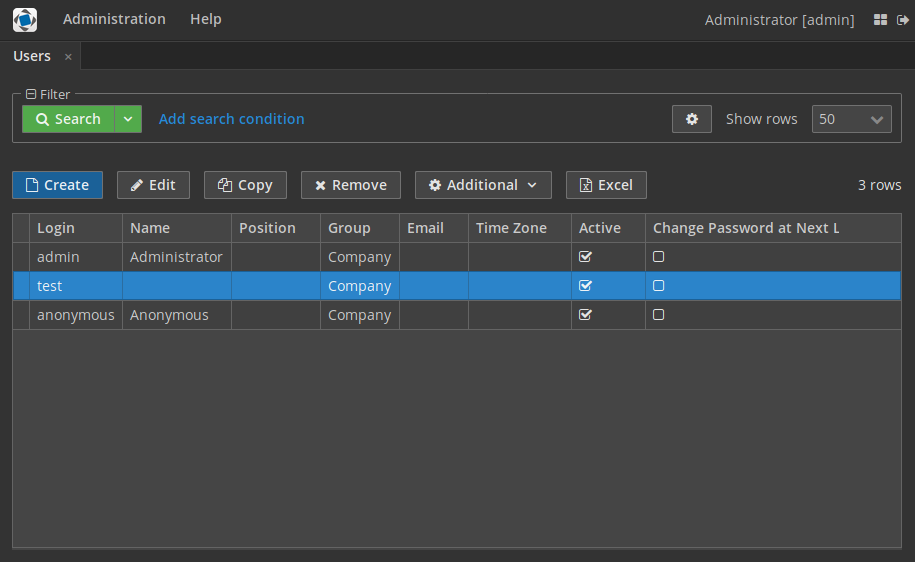

# Hover dark

The project contains a demo of dark variant of the `hover` theme.

There are only two simple steps to achieve this result:

1. Create custom theme via CUBA Studio: [documentation](https://doc.cuba-platform.com/manual-6.9/web_theme_creation.html)
2. Redefine default values for SCSS variables: [hover-dark-defaults.scss](https://github.com/cuba-platform/sample-hover-dark/blob/master/modules/web/themes/hover-dark/hover-dark-defaults.scss)

Based on CUBA 6.10

## Issues
Please use https://www.cuba-platform.com/discuss for discussion, support, and reporting problems coressponding to this sample.